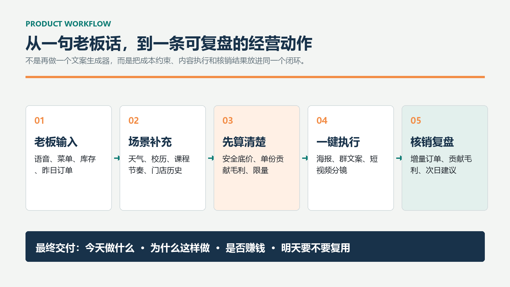
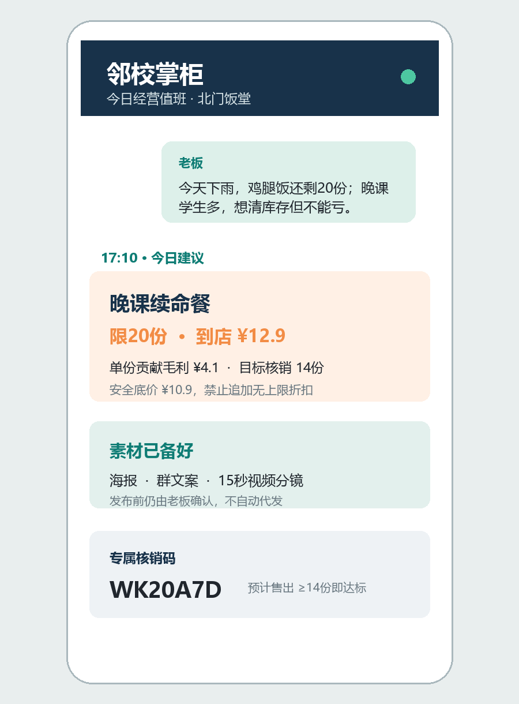
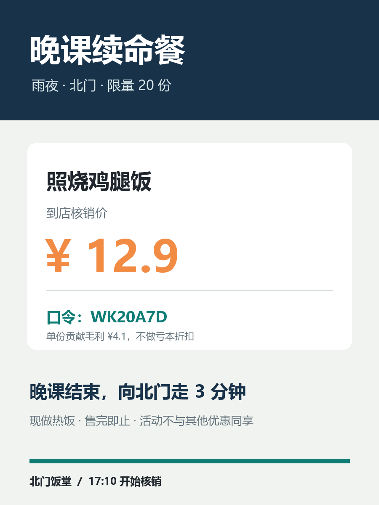
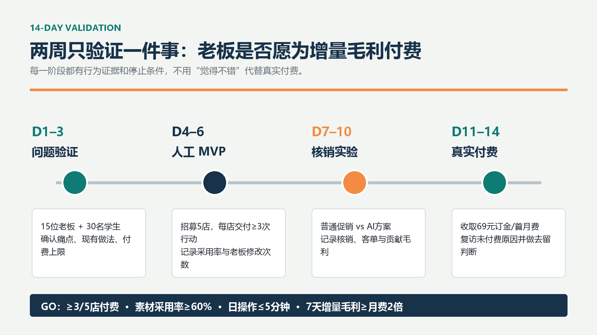
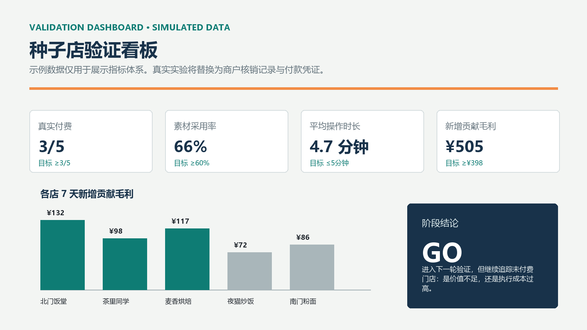

# 邻校掌柜

> 校园周边餐饮店的 AI 增长值班经理：先算清楚，再生成内容，最后用核销结果复盘。



## 项目概览

“邻校掌柜”面向高校 500 米内、1–3 家门店、老板亲自经营且没有专职运营的餐饮/茶饮店。老板输入一句经营描述和门店成本，系统给出一条可执行、可算账、可核销的今日行动。

一次完整交付包括：

- 今天做什么：活动主题、发布时间、价格与限量。
- 为什么这样做：天气、校园节奏、库存和经营目标。
- 是否赚钱：安全底价、单份贡献毛利、目标核销。
- 素材怎么发：海报、微信群文案、小红书图文、15 秒视频分镜。
- 明天要不要复用：专属核销码、自然销量基线和增量贡献毛利。

## 机会判断

- 目标用户：校园周边小型餐饮/茶饮门店老板。
- 核心痛点：客流强波动、促销靠经验、内容执行耗时、活动效果无法归因。
- 市场信号：2024 年高校商圈社会餐饮门店约 62 万家；餐饮企业中 98% 属于中小微企业。
- 关键假设：老板愿意为“可归因的增量贡献毛利”付费，而不是为 AI 文案本身付费。

完整证据、口径与局限见 [证据与来源](docs/evidence-and-sources.md)。

## 运行 Demo

要求 Python 3.10 及以上。

```bash
python -m venv .venv
# Windows
.\.venv\Scripts\activate
# macOS / Linux
source .venv/bin/activate

pip install -r requirements.txt
streamlit run demo/app.py
```


### 可选模型润色

配置以下环境变量后，侧边栏可启用真实模型。模型只润色内容，不参与定价。

```bash
OPENAI_API_KEY=your_key
OPENAI_MODEL=gpt-4.1-mini
# 可选：任何 OpenAI-compatible 服务地址
OPENAI_BASE_URL=https://api.openai.com/v1
```

仓库不包含 `.env` 或 `.streamlit/secrets.toml`，也不提交任何真实密钥。

## 项目交付

| 交付物 | 位置 |
|---|---|
| 一页 A4 Word | [`final/邻校掌柜_一页A4提交版.docx`](final/邻校掌柜_一页A4提交版.docx) |
| Streamlit MVP | [`demo/app.py`](demo/app.py) |
| 机会验证说明 | [`docs/opportunity-validation.md`](docs/opportunity-validation.md) |
| 产品与 MVP | [`docs/product-and-mvp.md`](docs/product-and-mvp.md) |
| 商业与两周计划 | [`docs/business-and-validation-plan.md`](docs/business-and-validation-plan.md) |
| 演示指南 | [`docs/demo-guide.md`](docs/demo-guide.md) |
| 视觉材料 | [`assets/`](assets/) |

## 视觉材料

| 工作流 | 聊天 Demo |
|---|---|
|  |  |

| 活动海报 | 验证计划 |
|---|---|
|  |  |



## 两周验证

1. D1–3：访谈 15 位老板和 30 名学生，验证痛点与付费上限。
2. D4–6：招募 5 家门店，每店人工交付至少 3 次经营行动。
3. D7–10：用专属核销码测试普通促销与 AI 方案。
4. D11–14：收取 69 元真实订金或首月费，复访未付费原因。

进入下一轮的条件：

- 至少 3/5 家真实付费。
- 素材采用率不低于 60%。
- 老板日操作不超过 5 分钟。
- 7 天新增贡献毛利不低于正式月费的 2 倍。

## 设计边界

- 不自动替老板发布内容。
- 不生成虚假评价或冒充学生体验。
- 不将模型输出直接用于价格决策。
- 不把播放量当成经营结果。
- Demo 看板使用明确标注的模拟数据，不能冒充真实实验结果。

## 生成与检查

```bash
python scripts/generate_assets.py
python scripts/build_submission.py
python -m compileall .
python -m pytest
```

## 目录

```text
assets/    可复现的展示图片
demo/      Streamlit 界面、领域模型和离线策略引擎
docs/      机会、产品、商业、证据与演示说明
final/     一页 A4 最终提交物
scripts/   视觉材料和 Word 生成脚本
tests/     经营计算与交付物检查
```

## 当前阶段

这是一次轻量机会验证，不是已经完成市场验证的正式 SaaS。当前最重要的后续动作不是继续增加功能，而是获得真实商户访谈、核销记录和付款凭证。
